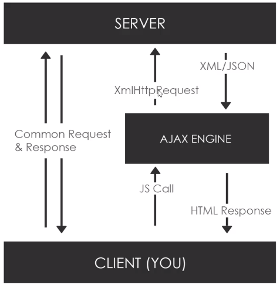

# Asynchronous Programming in JavaScript

### Example of Synchronous JavaScript
```javascript
posts = loadPostsSync();
// ...program waits until posts are fetched
// ...something happens with the posts

doTheNextThing(); // This line won't execute until the above lines have run.
```

### Example of Asynchronous Code
```javascript
loadPostsAsync(function() {
  // ...the callback function will wait until posts are fetched
  // ...the callback function will do something with the posts
});

doTheNextThing(); // Doesn't have to wait until the posts are loaded
```

Most Async code you work with will be part of an API or library
* XMLHttpRequest & Fetch
* jQuery Ajax, Axios, other HTTP libraries
* Node.js fs (filesystem) module

Ways to work with asynchronous code:
* Callbacks
* Promises
* Async/Await

## What is Ajax?
* Asynchronous JavaScript and XML
* Ajax is not a library or framework. It's a set of technologies to send and receive data from a client and server asynchronously.
* Even though XML is used in the acronym, it's rarely used anymore. JSON has replaced it.
* Ajax lets us make request "in the background". No page reload/refresh. Makes pages more interactive


### The XmlHttpRequest (XHR) Object
* API in the form of an object
* Provided by the browsers JS environment
* Methods transfer data between client/server
* Can be used with protocols other than HTTP as well
* **Can work with data other than XML** such as JSON and plain text
* Other libraries and methods to make HTTP Requests Include:
  * Fetch API (ships with vanilla js)
  * Axios (external library)
  * jQuery (external library)
  * Node HTTP (core node library)

Simple XHR Request Script
```javascript
function loadData() {
  // Create XHR object
  const xhr = new XMLHttpRequest();

  // OPEN
  xhr.open('GET', 'data.txt', true);

  xhr.onload = function() {
    if (this.status === 200) {
      document.getElementById('button').innerHTML = `<h1>${this.responseText}</h1>`;
    }
  }

  xhr.send();
}
```
**Note:** XHR `readyState` Values:
0: request not initialized
1: server connection established
2: request received
3: processing request
4: request finished and response is ready

**Another Example:** Fetching from a JSON file
```javascript
function loadCustomer(e) {
  const xhr = new XMLHttpRequest();

  xhr.open('GET', 'customer.json', true);

  xhr.onload = function() {
    if (this.status === 200) {
      const customer = JSON.parse(this.responseText); // JSON comes in as a string. Gotta parse it to use it as an object

      const output = `
        <ul>
          <li>ID: ${customer.id}</li>
          <li>Name: ${customer.name}</li>
          <li>Company: ${customer.company}</li>
          <li>Phone: ${customer.phone}</li>
        </ul>
      `;

      document.getElementById('customer').innerHTML = output;
    }
  }

  xhr.send();
}
```
## What is an API? (Application Programming Interface)
* A "contract" provided by one piece of software to another
* Usually consists of a structured requests and response

### REST APIs
* REST: Representational State Transfer
* Architecture style for designing networked applications
* Relies on a _stateless_, client server protocol, almost always HTTP
* Treats server objects as resources that can be created or destroyed
* Can be used by virtually any programming language
* All APIs have their own rules and structure

### HTTP Requests
* GET: retrieve data
* POST: submit data to be processed to a specific resource
* PUT: Update a specified resource
* DELETE: Delete a specified resource
* Other less often used requests:
  * HEAD
  * PATCH
  * OPTION

### API Endpoints
Examples:
* GET https://someurl.com/api/users     // Get all users
* GET https://someurl.com/api/users/1   // Get single user
* POST https://someurl.com/api/users    // Add user
* DELETE https://someurl.com/api/users/i // Delete user


